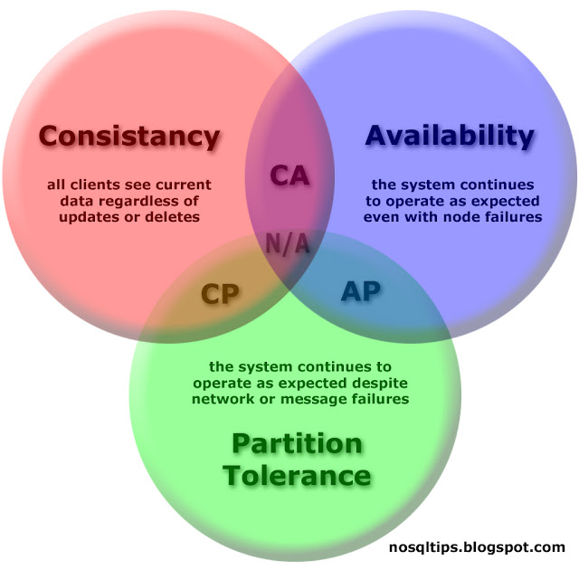

# Arquitetura de software

# Banco de Dados Distribuídos

São sistemas em que os dados são armazenados em vários servidores localizados em diferentes lugares. Esses servidores trabalham juntos para fornecer o acesso aos dados como se fossem um só banco

### Definição e diferença para bancos centralizados

Todos os dados estão em um único servidor, em uma única localização física, o que é mais simples, porém mais propenso a falhas e problemas de escalabilidade. No caso dos distribuídos, os dados sã divididos em vários servidores, o que melhora a escalabilidade, a tolerância a falhas e o desempenho para acessos geograficamente distribuídos (como por exemplo, se tiver um servidor da Google em Urussanga, o desempenho será melhor do que se tiver somente um nos Estados Unidos).

### Principais motivações para usar (escalabilidade, disponibilidade, performance).

- Escalabilidade: fica mais fácil de aumentar a capacidade de armazenamento e processamento
- Tolerância a falhas: se um servidor falhar, os outros podem cobrir ele, garantindo disponibilidade
- Desempenho: Acesso mais rápido a dados, especialmente quando os usuário estão distribuídos geograficamente.
- Alta disponibilidade: por ter varias cópias dos dados em vários locais, o sistema continua funcionando mesmo que uma parte falhe.
- Escalabilidade horizontal: ao invés de melhorar um único servidor (escala vertical), podemos adicionar novos servidores à rede (escala horizontal), o que é mais barato e flexível.

### Teorema CAP

É um conceito que diz ser impossível um sistema distribuído garantir simultaneamente essas três propriedades:



- Consistancy: todos os servidores (nós) veem os mesmos dados ao mesmo tempo
- Avaliability: o sistema sempre responde às requisições, mesmo que haja falhas
- Partition Tolerance: O sistema continua funcionando independentemente de falhas na comunicação entre servidores
    
    
    ### Exemplo:
    
    Supondo que temos dois servidores com o mesmo banco de dados (por exemplo, um em Urussanga e o outro na Islândia. Ocorreu um problema em se comunicar (isso é uma partição, o que já gasta um dos “usos”)
    
    Agora o sistema precisa escolher entre
    
    - Ser consistente (C): bloquear as operações até que o problema de comunicação seja resolvido, para não haver diferença entre os dados dos bancos
        - Exemplo: sistemas bancários (não pode mostrar saldo errado).
    - Ser disponível (A): continuar respondendo, mesmo que os dados fiquem diferentes temporariamente
        - Exemplo: redes sociais (você ainda pode curtir algo, mesmo que demore pra aparecer pros outros).
        

### Modelos de Banco de Dados Distribuídos

- Fragmentado ou Particionado
    
    Divide o banco em partes menores chamadas fragmentos, e cada fragmento fica armazenado em um servidor (nó) diferente
    
    Exemplo prático: Um sistema nacional de lojas.
    
    - O servidor de São Paulo guarda os clientes de SP.
    - O servidor de Santa Catarina guarda os clientes de SC.
    - O servidor do Rio de Janeiro guarda os clientes do RJ.
    
    Assim, as consultas são mais rápidas localmente.
    
    **Vantagens:**
    
    - Melhora o desempenho, pois reduz o volume de dados em cada servidor.
    - Diminui o tráfego na rede.
    - Aumenta a escalabilidade (você pode adicionar novos servidores facilmente).
    
    **Desvantagens:**
    
    - Pode ser difícil de manter a integridade entre os fragmentos.
    - Consultas que exigem dados de várias regiões ficam mais lentas (precisam “juntar” tudo depois).

- Replicado
    
    Cada servidor guarda uma cópia completa do banco de dados. Quando um dado muda em um nó, ele é copiado para os outros
    
    Exemplo prático: Redes sociais
    
    - Quando você posta algo, ele replica o conteúdo em vários servidores pelo mundo
    
    **Vantagens:**
    
    - Alta disponibilidade: se um servidor cair, outro assume.
    - Consultas mais rápidas (o dado pode ser buscado no servidor mais próximo).
    
    **Desvantagens:**
    
    - Difícil manter a consistência entre todas as cópias (sincronização).
    - Custo alto de rede para replicar os dados constantemente.

- Híbrido
    
    Combina os dois modelos anteriores: alguns dados são fragmentados, outros replicados.
    
    Exemplo prático: um sistema de e-commerce:
    
    - O catálogo de produtos é replicado (todos os servidores têm o mesmo catálogo).
    - Os dados de pedidos são fragmentados (cada região guarda os pedidos locais).
    
    **Vantagens:**
    
    - Combina desempenho e disponibilidade.
    - Flexível para diferentes tipos de dados.
    
    **Desvantagens:**
    
    - Maior complexidade para gerenciar e sincronizar os dois tipos.

### Experimento Prático: MongoDB e Bancos de Dados Distribuídos

### **Contexto do experimento**

O objetivo desta etapa foi **simular a distribuição de dados** em um ambiente de banco de dados MongoDB e **avaliar a diferença de tempo de resposta** entre uma coleção centralizada e coleções regionais distribuídas.

Além disso, também foi realizada a **exploração do mecanismo de replicação do MongoDB Atlas**, com o objetivo de compreender como o sistema garante **alta disponibilidade** e **tolerância a falhas**.

O trabalho foi realizado utilizando o **MongoDB Atlas (cluster M0 gratuito)** e o **MongoDB Shell (mongosh)** para execução das consultas, medição dos tempos e observação da topologia de replicação do cluster.

### Simulação de Distribuição

- Configuração do ambiente
    - Foi criada uma base de dados chamada **`loja`**.
    - Dentro dela, foram geradas **4 coleções**:
        - `produtos` — coleção geral, contendo **todos os 500 produtos**.
        - `produtos_sul` — contendo os produtos da região Sul.
        - `produtos_norte` — contendo os produtos da região Norte.
        - `produtos_sudeste` — contendo os produtos da região Sudeste.
    - Cada documento possui os seguintes campos:
        
        ```jsx
        {"nome": "Produto X",
          "categoria": "Eletrônicos",
          "preco": 299.99,
          "estoque": 50,
          "regiao": "Sul"}
        ```
        
    
    - Foram inseridos **500 produtos no total**, com variação de nome, categoria, preço, estoque e região.

- Consulta utilizada
    - Para comparar o tempo de execução entre as coleções, foi utilizada a mesma consulta em todas elas.
    - A consulta seleciona produtos da categoria **“Eletrônicos”**, ordena pelo **maior preço** e limita o resultado aos **50 primeiros** itens.
        
        ```jsx
        var start = new Date();
        db.<colecao>.aggregate([
          { $match: { categoria: "Eletrônicos" } },
          { $sort: { preco: -1 } },
          { $limit: 50 }
        ]).toArray();
        var end = new Date();
        print("Tempo de execução - <colecao>:", end - start, "ms");
        ```
        
    - O mesmo código foi executado substituindo `<colecao>` por:
        - `produtos`
        - `produtos_sul`
        - `produtos_norte`
        - `produtos_sudeste`

- Resultados obtidos
    
    
    |                   **Coleção** |               **Tempo (ms)** |                **Observação** |
    | --- | --- | --- |
    |                   produtos |                     **26 ms** | Contém todos os 500 produtos |
    |                produtos_sul |                     **24 ms** | Menor volume de dados, resposta um pouco mais rápida |
    |              produtos_norte  |                     **25 ms** | Desempenho semelhante |
    |           produtos_sudeste |                     **23 ms** | Melhor resultado geral |

- Evidências (Prints do terminal Mongosh)
    - **Consulta – coleção geral (`produtos`)**
        
        
        
    - **Consulta – coleção regional (`produtos_sul`)**
        
        
        
    - **Consulta – coleção regional (`produtos_norte`)**
        
        
        
    - **Consulta – coleção regional (`produtos_sudeste`)**
        
        
        

- Análise dos resultados
    
    As diferenças de tempo foram pequenas (entre **23 ms e 26 ms**) devido a fatores como:
    
    - O **baixo volume de dados (500 documentos)**, que o MongoDB consegue processar integralmente em memória;
    - O fato de todas as coleções estarem hospedadas **no mesmo cluster Atlas**, sem separação física real por região;
    - O **cache interno** do servidor, que reduz o tempo nas execuções subsequentes.
    
    Mesmo assim, a simulação permitiu observar um **padrão consistente**: as coleções menores (regionais) responderam **ligeiramente mais rápido** do que a coleção centralizada.
    
    Isso ilustra, em escala reduzida, um dos benefícios da **distribuição de dados (sharding):** Reduzir a carga em uma única coleção e melhorar o tempo de resposta de consultas localizadas.
    

### Teste de Replicação no MongoDB

- O que é
    
    A **replicação** é o mecanismo que o MongoDB usa para **garantir disponibilidade e tolerância a falhas**.
    
    Um **replica set** é formado por:
    
    - **1 Primary** → recebe gravações e distribui alterações;
    - **1 ou mais Secondaries** → fazem cópias contínuas do banco primário;
    - (opcional) **1 Arbiter**, que ajuda a eleger um novo Primary em caso de falha.
    
    Esses nós mantêm os dados sincronizados automaticamente via **oplog (operation log)**.
    

- Documentação técnica
    
    O MongoDB Atlas utiliza por padrão a arquitetura de **Replica Set**, garantindo alta disponibilidade dos dados.
    
    Cada réplica mantém uma cópia completa do banco de dados.
    
    Quando o nó primário fica indisponível, o cluster realiza uma **eleição automática** entre os secundários, promovendo um novo Primary em poucos segundos — sem necessidade de intervenção manual.
    
    Isso assegura que o sistema continue **operacional mesmo em casos de falha** (alta disponibilidade) e que **nenhum dado seja perdido** (consistência garantida pelo oplog).
    

- Teste
    - Ao acessar o painel de métricas do cluster no **MongoDB Atlas**, é possível visualizar os três nós que compõem o **Replica Set**:
        
        
        
    
    - Os nomes “`ac-fdco1lm-shard-00-00`, `-01` e `-02` representam os três servidores que mantêm cópias sincronizadas do banco de dados.
    - Um desses nós é o **Primary**, responsável por todas as operações de escrita,
    - e os demais atuam como **Secondaries**, replicando os dados de forma contínua.
        
        
    - Funcionamento da replicação
        
        O MongoDB utiliza um log interno chamado **oplog (operation log)**.
        
        Cada operação realizada no Primary (como inserções, atualizações e deleções) é registrada nesse log e **reproduzida automaticamente nos Secondaries**.
        
        Esse processo acontece em tempo real e garante que todos os nós permaneçam sincronizados.
        
    
    - Alta disponibilidade
        
        Em caso de falha do nó principal (Primary), o sistema realiza automaticamente uma **eleição** entre os nós secundários.
        
        O nó eleito assume como novo Primary, garantindo que o banco continue **operando sem interrupções**.
        
        Isso caracteriza a **alta disponibilidade**, um dos pilares dos sistemas distribuídos modernos.
        

- Resumo
    
    O teste de replicação confirmou que o MongoDB Atlas mantém múltiplas cópias do banco em diferentes servidores (Replica Set).
    
    Essa configuração assegura que o sistema continue ativo mesmo em caso de falha de um dos nós, oferecendo **disponibilidade contínua**, **redundância de dados** e **tolerância a falhas**.
    

### Análise e Reflexão

### **Vantagens observadas**

Durante o experimento prático, foi possível observar diversos benefícios no uso de **bancos de dados distribuídos**:

- **Melhor desempenho em consultas específicas**: ao dividir os dados entre coleções regionais (`produtos_sul`, `produtos_norte`, `produtos_sudeste`), as consultas passaram a acessar conjuntos menores, o que resultou em tempos de execução ligeiramente menores (diferença entre 23 ms e 26 ms).
- **Escalabilidade**: a fragmentação (sharding) dos dados permite que o sistema cresça de forma modular, adicionando novos servidores conforme a demanda aumenta.
- **Alta disponibilidade**: o uso de réplicas no MongoDB Atlas garante que o banco continue operando mesmo em caso de falhas no nó principal.
- **Tolerância a falhas**: a replicação automática entre os nós do cluster protege os dados e reduz o risco de perda de informações.

### **Desafios identificados**

Apesar dos bons resultados, alguns desafios e limitações foram identificados:

- **Diferença pequena entre tempos**: como o ambiente de teste era pequeno (apenas 500 registros) e rodando em um único cluster, as variações de desempenho foram pequenas. Em um sistema real, com muito mais registros e servidores, a diferença seria muito maior
- **Complexidade na configuração**: sistemas distribuídos precisam de maior atenção na configuração e manutenção, principalmente no controle de replicação, sincronização e resolução de conflitos.
- **Consistência de dados**: em ambientes com muitos nós, garantir que todos estejam atualizados ao mesmo tempo pode ser um desafio, especialmente em sistemas que priorizam disponibilidade.

### Aplicação do Teorema CAP

- No caso do **MongoDB**, ele prioriza **Disponibilidade (A)** e **Tolerância à Partição (P),** porquê o banco continua operando mesmo se parte da rede estiver indisponível.
- Em cenários onde a aplicação precisa continuar ativa a todo custo (como e-commerce e sistemas de pedidos), a disponibilidade é priorizada.
- Já em contextos financeiros, como bancos, ocorre o contrário, a prioridade é na consistência, mesmo que haja indisponibilidade.

### **Cenários de uso**

- **Bancos de dados distribuídos seriam ideais em:**
    - **Sistemas de e-commerce** – grandes volumes de transações simultâneas, espalhados por diferentes regiões do país ou do mundo.
    - **Aplicações de streaming ou redes sociais** – necessitam de alta disponibilidade e velocidade de leitura, com dados replicados em diversos servidores.
- **Um banco centralizado seria melhor em:**
    - **Sistemas internos de controle financeiro**  onde a consistência dos dados é mais importante que a disponibilidade contínua (por exemplo, fechamento contábil e cálculos fiscais).